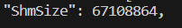
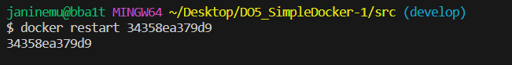
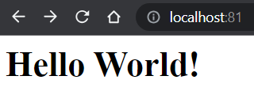
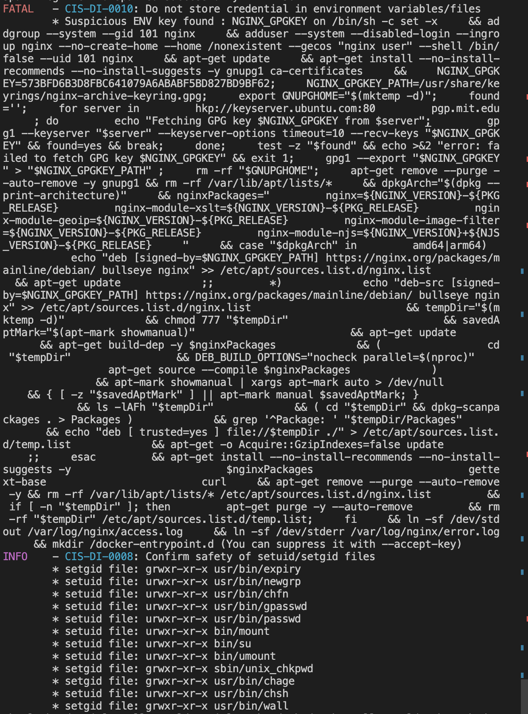

## Part 1. Готовый докер

1. Взять официальный докер образ с **nginx** и выкачать его при помощи `docker pull`
    

2. Проверить наличие докер образа через `docker images`
    

3. Запустить докер образ через `docker run -d [image_id|repository]`
    

4. Проверить, что образ запустился через `docker ps`
    

5. Посмотреть информацию о контейнере через `docker inspect [container_id|container_name]`
    

6. По выводу команды определить и поместить в отчёт размер контейнера, список замапленных портов и ip контейнера
    
    
    

7. Остановить докер образ через `docker stop [container_id|container_name]`
    

8. Запустить докер с портами 80 и 443 в контейнере, замапленными на такие же порты на локальной машине, через команду `run`
    

9. Проверить, что в браузере по адресу `localhost:80` доступна стартовая страница `nginx`
    

10. Перезапустить докер контейнер через `docker restart [container_id|container_name]`
    

11. Проверить любым способом, что контейнер запустился
    

## Part 2. Операции с контейнером

1. Прочитать конфигурационный файл `nginx.conf` внутри докер контейнера через команду `exec`
    

2. Создать на локальной машине файл `nginx.conf`, скопировать в него базовый файл конфигурации, а затем настроить в нем `/status`, отдачу страницы статуса сервера `nginx.`
Этот файл должен заменить конфигурацию NGINX в контейнере.
    

3. Скопировать созданный файл `nginx.conf` внутрь докер образа через команду `docker cp`
    

4. Перезапустить `nginx` внутри докер образа через команду `exec`
    

5. Проверить, что по адресу `localhost:80/status` отдается страничка со статусом сервера `nginx`
    

6. Экспортировать контейнер в файл `container.tar` через команду `export`
    

7. Остановить контейнер
    

8. Удалить образ через `docker rmi [image_id|repository]`
    

9. И удаляю котейнеры через `docker system prune -a`
    

10. Импортировать контейнер обратно через команду `import`
    

    - `nginx -g daemon off;` - гарантирует, что Nginx останется «на переднем плане», так что Docker сможет правильно отслеживать процесс, в противном случае контейнер остановится сразу после запуска

11. Запускаю контейнер и смотрю вывод программы
    
    

## Part 3. Мини веб-сервер

1. Запустить докер с портами 81 , замапленными на такие же порты на локальной машине, через команду `run`
    

2. Проверить, что образ запустился через `docker ps`
    

3. Написать мини сервер на **C** и **FastCgi**, который будет возвращать простейшую страничку с надписью `Hello World!`
    

4. Написать свой `nginx.conf`, который будет проксировать все запросы с 81 порта на `127.0.0.1:8080`
    

5. Скопировать свой *nginx.conf* и мини сервер в докер
    

6. Заходим сам в контейнер
    

7. Запустить написанный мини сервер через *spawn-fcgi* на порту 8080
    

8. Проверить, что в браузере по *localhost:81* отдается написанная вами страничка
    

- Положить файл `nginx.conf` по пути `Part_4/nginx/nginx.conf`(это понадобится позже)

## Part 4. Свой докер

1. Написать свой докер образ, который
    
    

2. Собрать написанный докер образ через `docker build` при этом указав имя и тег

     Проверить через `docker images`, что все собралось корректно
    

3. Запустить собранный докер образ с маппингом 81 порта на 80 на локальной машине и маппингом папки *./nginx* внутрь контейнера по адресу, где лежат конфигурационные файлы **nginx**

    - Проверить, что по localhost:80 доступна страничка написанного мини сервера
    

4. Дописать в *./nginx/nginx.conf* проксирование странички */status*, по которой надо отдавать статус сервера **nginx**
    

5. Перезапустить докер образ

    - Проверить, что теперь по *localhost:80/status* отдается страничка со статусом **nginx**
    

## Part 5. **Dockle**

1. Просканировать образ из предыдущего задания через `dockle [image_id|repository]`
    

2. Исправить образ так, чтобы при проверке через **dockle** не было ошибок и предупреждений
    

## Part 6. Базовый **Docker Compose**

- Написать файл *docker-compose.yml*, с помощью которого

    1. Поднять докер контейнер из Части 5 (он должен работать в локальной сети, т.е. не нужно использовать инструкцию **EXPOSE** и мапить порты на локальную машину)_

    2. Поднять докер контейнер с **nginx**, который будет проксировать все запросы с 8080 порта на 81 порт первого контейнера

- Замапить 8080 порт второго контейнера на 80 порт локальной машины
    

- Собрать и запустить проект с помощью команд `docker-compose build` и `docker-compose up`
    Проверить, что в браузере по *localhost:80* отдается написанная вами страничка, как и ранее
    
