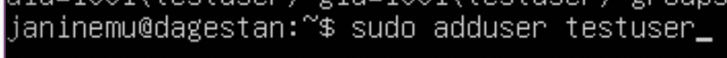

##Part 1. Установка ОС
* Показана установленная версия убунту

##Part 2. Создание пользователя
* Команда для создания пользователя

* Вывод команды cat /etc/passwd

* В какой группе состоит пользователь

##Part 3. Настройка сети ОС
* Новое название машины

* Установлена временная зона

* Сетевые интерфейсы.

`lo (loopback device)` – виртуальный интерфейс, присутствующий по умолчанию в любом Linux. Он используется для отладки сетевых программ и запуска серверных приложений на локальной машине. С этим интерфейсом всегда связан адрес 127.0.0.1. У него есть dns-имя – localhost.

* IP адрес устройства;

`DHCP (Dynamic Host Configuration Protocol` — протокол динамической настройки узла) — прикладной протокол, позволяющий сетевым устройствам автоматически получать IP-адрес и другие параметры, необходимые для работы в сети TCP/IP.

* Внешний `ip`

Внутренний `ip`

* Задал статичные значения `ip`

 addresses - это внутренний айпи, а / видно в `enp0s3` при `ip` a

* Пропинговал значения

##Part 4. Обновление ОС
* Сообщение об отсутствии(наличии) обновлений

##Part 5. Использование команды sudo
* Даю разрешение пользователю

* Изменил имя хоста через другого пользователя

    Судо позволяет разрешенному пользователю выполнять команду в качестве суперпользователя или другого пользователя

##Part 6. Установка и настройка службы времени
* Скриншот все описывает

##Part 7. Установка и использование текстовых редакторов

* Записал свой никнейм с помощью NANO. Для выхода и сохранения: `Сtrl + O`

* `NANO` для выхода без сохранения: `Ctrl + X + не подтвердил сохранение(No)`

* Поиск в NANO осуществляется: `Ctrl + W`, нужный результат подсвечивается(я не успеваю заскринить)

* Замена слова в NANO осуществляется: `Ctrl + \`
Слово для поиска

 Слово замена

* Записал свой никнейм с помощью редактора `VIM`. Для выхода и сохранения: `:qw`

* `VIM` для выхода без сохранения: `:q!`

* Поиск в `VIM` осуществляется: `/ + слово для поиска` - поиск внизу курсора, `? + слово для поиска` - поиск сверху курсора

* Замена слова в VIM осуществляется: `:s/слово_поиск/слово_замена`

* Записал свой ник с помощью редактора `MCEDIT`. Для сохранения `F2`, для выхода `ESC` или `F10`

* `MCEDIT` для выхода без сохранения `F10` или `ESC`

* `MCEDIT` для поиска `F4`

##Part 8. Установка и базовая настройка сервиса SSHD

* Устанавлиаю пакет SSHd: `sudo apt-get install ssh`
* Добавляю пакет в автозапуск: `sudo systemctl enable sshd`
* Перенастроил службу SSHd на порт 2022: `sudo nano /etc/ssh/sshd_config`

* Наличие процесса `sshd`:
  - `ps` - показывает все текущие процессы 
  - `-C` - поиск процесса по коюч-слову

* Вывод команды `netstat -tan`

* Значения ключей:
  - `-a` - перечислить все порты
  - `-n` - показывать ip адрес, а не сетевое имя
  - `-t` - показывает TCP-порты
  - `0.0.0.0` - это немаршрутизированный IPv4-адрес, который может использоваться для различных целей, в основном в качестве адреса по умолчанию или заполнителя
  - `Recv-Q` - счётчик байт не скопированных программой пользователя из этого сокета, поулчено
  - `Send-Q` - cчётчик байтов, не подтверждённых удалённым узлом, отправлено
  - `State` - состояние сокета
  - `Local Address` - адрес и номер порта у сокета

##Part 9. Установка и использование утилит top, htop

* Вывод каманты `top`

  - `Uptime ` - 3 часа 43 минуты
  - `Количество авторизованных пользователей` - 1
  - `Общуая загрузка системы` - 0 за 1, 5 и 15 минут
  - `Общее количество процессов` - 113
  - `Загрузку cpu sy` - 0.0 
  - `Загрузку памяти` - 184,3 Мб
  - `pid процесса занимающего больше всего памяти` - 714, для сортировки `M`
  
  - `pid процесса, занимающего больше всего процессорного времени` - 181|2900|2984, для сортировки `P`
  

* Вывод команды `htop`
  - Вывод по `PID`
  
  - Вывод по `PERCENT_CPU`
  
  - Вывод по `PERCENT_MEM`
  
  - Вывод по `TIME`
  
  - Фильтр для процесса `sshd`
  
  - Процессом `syslog`, найденный, используя поиск
  
  - Добавил `hostname, clock, uptime`
  

##Part 10. Использование утилиты fdisk
  
* Название жесткого диска - `VBOX HARDDISK`
* Размер жестокго диска - `25GB`
* Кол-во секторов - `52428800`
* Размер swap - `2,3GB`
  

##Part 11. Использование утилиты df
* Размер раздела - `12GB`
* Размер занятого пространства - `4,9GB`
* Размер свободного пространства - `5,9GB`
* Процент использования - `46%`
* По стандурту инфорация выводится в байтах, но флаг `-h` выводит в гигабайтах, мегабайтах и килобайтах

##Part 12. Использование утилиты du
* Размер /home `116KB`

* Размер /var `569MB`

* Размер /var/log `35MB`

* Размер каждого вложенного элемента в `sudo du -ah /var/log/* | less`

##Part 13. Установка и использование утилиты ncdu
* Размер /home `116KB`
* Размер /var `675MB`

* Размер /var/log `35MB`

##Part 14. Работа с системными журналами
* Время последней успешной авторизации - `20:42:16`
* Имя пользователя - `janinemu`
* Метод входа в систему - `pam_unix(по паролю)`

* Перезагрузка службы `SSHd`

##Part 15. Использование планировщика заданий CRON
* Строчки о выполнении аптайма(выводил каждую минуту, было лень ждать)

* Мой крон

* Удалил задание

