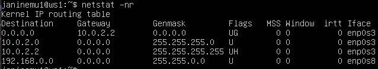
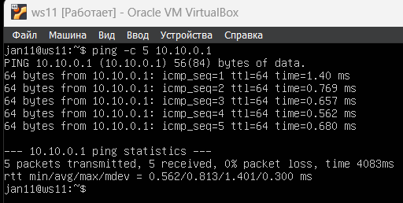
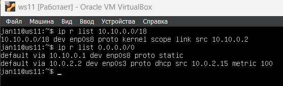
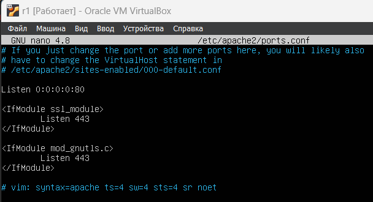
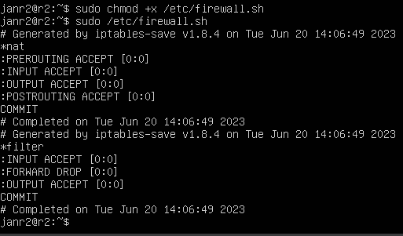

## Part 1. Инструмент ipcalc

* Опции: 
    * `-n` —nocolor Подавить вывод цветов
    * `-b` —nobinary Подавить поразрядный вывод
    * `-c` —class Показать маску сети по адресу
    * `-h` —html Показать результаты в HTML
    * `-v` —version Показать версию программы
    * `-s` —split n1 n2 n3 Разделить сети по размеру n1, n2, n3
    * `-r` —range Исключить диапазон адресов
    * `—help` —Помощь

### 1.1 Сети и маски

* Определения адреса сети `192.167.38.54/13`
  
  полученный адрес сети - `192.167.38.54`

* Перевод маски `255.255.255.0` в:
    
  префиксная запись - `/24` \
  двоичная запись - `11111111.11111111.11111111.00000000`

* Перевод маски `/15` в:
    
  обычная форма - `255.254.0.0` \
  двоичная форма - `11111111.11111110.00000000.00000000`

* Перевод маски `11111111.11111111.11111111.11110000` в:
  обычная форма - `255.255.255.240`
  префиксная форма - `/28`
  

* Определения минимального и максимального хоста в сети `12.167.38.4`
    * Маска `/8`
    HostMin : `12.0.0.1`
    HostMax : `12.255.255.254`
    

    * Маска `/11111111.11111111.00000000.00000000 (/16)`
    HostMin : `12.167.0.1`
    HostMax : `12.167.255.254`
    

    * Маска `255.255.254.0 (/23)`
    HostMin : `12.167.38.1`
    HostMax : `12.167.39.254`
    

    * Маска `/4`
    HostMin : `0.0.0.1`
    HostMax : `15.255.255.254`
    

### 1.2. localhost

* Для определения возможности обратиться к приложению, работающему на localhost воспользуемся командой `ping`\
  localhost(127.0.0.1) - адрес обратной связи \
    * `194.34.23.100` - ответа нет
    * `127.0.0.2` - ответ получен
    * `127.1.0.1` - ответ получен
    * `128.0.0.1` - ответа нет
     

### 1.3. Диапазоны и сегменты сетей

* ipcalc опеределяет является ли адрес частным или нет
    * `10.0.0.45` - частный \
    
    * `134.43.0.2` - публичный \
    
    * `192.168.4.2` - частный \
    
    * `172.20.250.4` - частный \
    
    * `172.0.2.1` - публичный \
    
    * `192.172.0.1` - публичный \
    
    * `172.68.0.2` - публичный \
    
    * `172.16.255.255` - частный \
    
    * `10.10.10.10` - частный \
    
    * `192.169.168.1` - публичный \
    

*  Определить какие из перечисленных IP адресов шлюза возможны у сети `10.10.0.0/18`.
   Если IP адрес возможен он должен попадать в промежуток между HostMin и HostMax\
   
    * 10.0.0.1 - невозможен
    * 10.10.0.2 - возможен
    * 10.10.10.10 - возможен
    * 10.10.100.1 - невозможен
    * 10.10.1.255 - возможен

## Part 2. Статическая маршрутизация между двумя машинами
* Посмотрим существующие сетевые интерфейсы на 2-х виртуальных машинах с помощью команды `ip a`

    * 1-ая виртуальная машина (далее ws1) \
  

    * 2-ая виртуальная машина (далее ws2) \
  

* Чтобы настроить локальную сеть: выключаем обе машины, заходим в настройки -> сеть -> подключаем на обеих машинах новый адаптер, в качестве типа подключения выбираем "внутренняя сеть" и задаем ей одинакоове имя у обеих машин.
    

* Меняем адреса и маски машин с помощью редактирования файла `etc/netplan/00-installer-config.yaml` \
    Используем команду `sudo nano etc/netplan/00-installer-config.yaml`. Так как мы подключили новый сетевой адаптер, будем прописывать настройки для нового сетевого интерфейса (enp0s8). Отключаем на нем автоматическое получение ip через dhcp и прописываем желаемый адрес в строке address. В итоге файлы должны выглядеть так:
    * ws1 (192.168.100.10/16) \
     

    * ws2 (172.24.116.8/12)\
     

* выполним команды `netplan apply` и `netplan try` для перезапуска сервиса сети
    * ws1 \
     

    * ws2 \
     

### 2.1. Добавление статического маршрута вручную

* Добавим статический маршрут от одной машины до другой и обратно при помощи команды `ip route add`

  * Добавляем статический маршрут с помощью команды `ip r add [ip-адрес] dev enp0s8` \
    Снова вызывваем `netstat -nr`, чтобы проверить, что маршрут действительно задан.
    * ws1 \
     

    * ws2 \
     

* Пропинговать соединение между машинами
    * Проверяем подключение с помощью команды `ping -c 5 [ip-адрес]` \
    
    
    0% pocket loss - пропинговали успешно

### 2.2. Добавление статического маршрута с сохранением

* Перезапускаем машины и видим, что наши маршруты не сохранились
  `netstat -nr`
  
  

* Добавляем статический маршрут от одной машины до другой с помощью файла `etc/netplan/00-installer-config.yaml`
  Добавляем строчку `routes` и прописываем маршурты. В строке `to` задаем адрес, до которого необходим маршрут, в строке `via` - адрес шлюза
    
    

* Применяем настройки конфигурации (`sudo netplan apply` и `sudo netplan try`)
    Наши маршруты появились в таблице маршрутизации
    
    

* Пингуем машины для проверки подключения 
    
    

## Part 3. Утилита iperf3

### 3.1. Скорость соединения
- 8 Mbps = 1 MB/s
- 100 MB/s = 800000 Kbps
- 1 Gbps = 1024 Mbps  
(bps - бит в секунду, B/s - байт в секунду)

### 3.2. Утилита iperf3
* Утилита `iperf` - это генератор сетевого трафика, предназначенный для проверки скорости и пропускной способности сети.  Она поддерживает работу как по протоколу TCP, так и по UDP. Для проведения тестирования надо запустить iperf3 как на сервере, так и на клиенте. Клиентская часть будет генерировать трафик, а серверная - принимать и отбрасывать.

- Устанавливаем утилиту `sudo apt install iperf3`
- На одной машине запускаем iperf3 в режиме сервера: `iperf3 -s`.  
Сервер по дефолту начнет слушать порт 5021
- На второй машине запускаем iperf3 в клиенстком режиме: `iperf3 -c [адрес сервера]`

* Утилита будет инициировать сетевое соединение на указанный адрес хоста (домен либо IP) через порт 5021. Будет начато тестирование. На протяжении 10 секунд между этими хостами будет идти обмен трафиком, после чего соединение будет завершено и будет выведена информация с результатами теста.

* Серверная версия на первой машине: `iperf3 -s` \
    
    
* Клиентская версия на второй машине: `iperf3 -c 192.168.100.10`\
    

## Part 4. Сетевой экран

### 4.1. Утилита iptables
- Создаем файл /etc/firewall.sh, имитирующий фаерволл, на ws1 и ws2: `sudo touch /etc/firewall.sh`

- Открываем файлы для редактирования и добавления туда правил: `sudo nano /etc/firewall.sh`. Добавляем команды для очищения всех правил (`iptables -F`) и удаления цепочки (`iptables -X`)

- Добавляем в файл `/etc/firewall.sh` правила:
    - открыть на машинах доступ для порта 22 (ssh) и порта 80 (http)
    - на первой машине: запрещаем и разрешаем echo-reply
    - на второй машине: разрешаем и запрещаем echo-reply
    - В итоге файлы выглядят так: \
    
    

- Запустить файлы на обеих машинах командами `sudo chmod +x /etc/firewall.sh` и `/etc/firewall.sh`
    * `sudo /etc/firewall.sh`
    
    

- Правила в `iptables` работают сверху вниз, поэтому порядок правил имеет значение. Разница между правилами на первой и второй машинах заключается в порядке запрета и разрешения echo-reply. На первой машине мы сначала запрещаем, значит, следующее разрешение не сработает и машина пинговаться не будет. На второй машине все наоборот: сначала шло разрешение, значит она будет пинговаться несмотря на последующий запрет.

### 4.2. Утилита nmap
`Nmap (“Network Mapper”)` это утилита с открытым исходным кодом для исследования сети и проверки безопасности. Инструмент Nmap предназначен прежде всего для сканирования сети и аудита безопасности.

- Проверяем, работают ли установленные нами правила, - пингуем машины.
    - `ping -c 5 172.24.116.8` на первой машине и `ping -c 5 196.168.100.10` на второй
    
    
    Вторая машина пропинговалась успешно, а первая не пропинговалась. Всё верно, так мы и прописывали в файле firewall.sh

- Проверяем, что при этом хост запущен
    - `nmap 172.24.116.8` и `nmap 196.168.100.10`
    
    
    "Host is up" есть - значит, хост работает.

- Сохранить дампы образов виртуальных машин
    - Выбираем Снимки -> Сделать, задаем имя для снимка.
    

## Part 5. Статическая маршрутизация сети

### 5.1. Настройка адресов машин

- Поднимаем пять виртуальных машин: 3 рабочие станции (ws11, ws21, ws22) и 2 роутера (r1, r2)

- После создания всех машин переходим для каждой из них в <b>Настройки</b> -> <b>Сеть</b> и делаем следующие манипуляции с адаптерпами:

    <b>r1</b>  
    - Оставляем первый адаптер под NAT
    - Подключаем второй адаптер -> Внутренняя сеть -> устанавливаем имя сети "intnet1"
    - Подключаем третий адаптер -> Внутренняя сеть -> устанавливаем имя сети "intnet2"

    <b>r2</b>  
    - Оставляем первый адаптер под NAT
    - Подключаем второй адаптер -> Внутренняя сеть -> устанавливаем имя сети "intnet2"
    - Подключаем третий адаптер -> Внутренняя сеть -> устанавливаем имя сети "intnet3"

    <b>ws11</b>  
    - Оставляем первый адаптер под NAT
    - Подключаем второй адаптер -> Внутренняя сеть -> устанавливаем имя сети "intnet1"

    <b>ws21</b>  
    - Оставляем первый адаптер под NAT
    - Подключаем второй адаптер -> Внутренняя сеть -> устанавливаем имя сети "intnet3"

    <b>ws22</b>  
    - Оставляем первый адаптер под NAT
    - Подключаем второй адаптер -> Внутренняя сеть -> устанавливаем имя сети "intnet3"

    Таким образом у нас будет три локальные сети: intnet1 (10.10.0.0/18), intnet2 (10.100.0.0/16), intnet3 (10.20.0.0/26)
    .
    Далее изменяем файл конфигурации на каждой машине (команда `sudo nano /etc/netplan/etc/netplan/00-installer-config.yaml`). Прописываем всем машинам адреса в соответвтии со схемой

    - Так в итоге выглядят файлы конфигурации сети: \
    
    
    
    
    

    После этого делаем `sudo netplan apply` на каждой машине, чтобы применить эти настройки.

- Перезапускаем машины. Проверяем, что все настройки сохранились и выглядят в соответствии со схемой. Для этого выводим все сетевые интерфейсы с адресами командой `ip -4 a`
    
    
    
    
    

- Пингуем машину ws22 с ws21, а также r1 с ws11

    - На машине ws11: `ping -c 5 10.10.0.1`  
    На машине ws21: `ping -c 5 10.20.0.20` \
    
    
    Всё пропинговалось - значит, мы правильно настроили сети.

### 5.2. Включение переадресации IP-адресов.
- Включаем переадресацию IP на роутерах командой `sysctl -w net.ipv4.ip_forward=1`. При таком подходе переадресация не будет работать после перезагрузки системы.
    - Вывод команды `sysctl -w net.ipv4.ip_forward=1`\
    
    

- Чтобы переадресация была включена на постоянной основе, надо изменить файл `/etc/sysctl.conf`. Открываем его командой `sudo nano /etc/sysctl.conf` и раскоментируем строку `net.ipv4.ip_forward = 1`.
    - В итоге файл /etc/sysctl.conf на обоих роутерах должен выглядеть так: \
    
    

### 5.3. Установка маршрута по-умолчанию
- Задаем маршрут по умолчанию (шлюз) для рабоичх станций. Для этого снова будем редактировать файл конфигурации сети `sudo nano etc/netplan/00-installer-config.yaml`. Раньше для настройки адреса шлюза использовали директиву `gateway4`, но теперь она считается устаревшей и вместо нее используется `routes` со значениями `to: default` и `via: [адрес шлюза]`

    - Добавляем шлюз по умолчанию на ws11. В итоге файл должен выглядеть так: \
    

    - На ws21 и ws22 проделываем то же самое, файлы yaml выглдядят так: \
    
    
    Вызываем `sudo netplan apply`

- Вызываем команду `ip r`, чтобы проверить, что шлюз добавился в таблицу маршрутизации

    - Первой строчкой идет добавленный нами маршрут по умолчанию с адресом соответсвуюшего роутера (для ws11 - 10.10.0.1, для ws21 и ws22 - 10.20.0.1)\
    
    
    

- Пропингуем с ws11 роутер r2 и показать на r2, что пинг доходит. 

    <i>Утилита tcpdump - это инструмент для перехвата и анализа сетевых пакетов. Она позволяет просматривать все входящие и исходящие из определенного интерфейса пакеты .</i>

    На r2 запускаем утилиту tcpdump комнадой `tcpdump -tnv -i enp0s8`, чтобы посмотреть весь трафик на указанном интерфейсе.

    На машине ws11 используем команду `ping -c 5 10.100.0.12` (это адрес r2).
    - На машине ws11 видим, что r2 не пингуется. \
    

    - Однако на r2 видим, что отправленные с ws11 пакеты доходят. Значит, пинг доходит, просто машина ws11 не получает ответа. \
    

### 5.4. Добавление статических маршрутов
- Добавляем для каждого роутера статические маршруты до сети, по которой другой роутер связан с рабочими станциями.  
Для интерфейса, отвечающего за связывающую роутеры сеть 10.100.0.0/16, добавляем маршруты как на фото ниже

- Файлы конфигурации роутеров должны выглядеть так: \
    
    

- Вызываем `ip r` и показаем таблицы с маршрутами на обоих роутерах
    
    
    У роутера r1 появился маршрут до сети 10.20.0.0/26, а у r2 появился маршрут - до 10.10.0.0/18

- На ws11 запускаем команды `ip r list 10.10.0.0/18` и `ip r list 0.0.0.0/0`
    

### 5.5. Построение списка маршрутизаторов
<i>Traceroute — это утилита, которая позволяет проследить маршрут следования данных до удалённого адресата в сетях TCP/IP.</i>
- Запускаем на r1 команду дампа: `tcpdump -tnv -i enp0s8`

- На ws11 устанавливаем утилиту traceroute. Запускаем команду `traceroute 10.20.0.10`, чтобы проследить маршрут от ws11 до ws21

    - Вывод команды tracaroute на ws11. Видим, что маршрут пролегает чрез три узла: 10.10.0.1 (r1), 10.100.0.12 (r2) и наконец 10.20.0.10 - адрес финальной точки ws21 \
    

    - Вывод команды tcpdumd на r1 \
    

    <b>Принцип работы построения пути при помощи traceroute</b>  
    Каждый пакет проходит на своем пути определенное количество узлов, пока достигнет своей цели. Причем, каждый пакет имеет свое время жизни. Это количество узлов, которые может пройти пакет перед тем, как он будет уничтожен. Этот параметр записывается в заголовке TTL, каждый маршрутизатор, через который будет проходить пакет уменьшает его на единицу. При TTL=0 пакет уничтожается, а отправителю отсылается сообщение Time Exceeded.

    Команда traceroute linux использует UDP пакеты. Она отправляет пакет с TTL=1 и смотрит адрес ответившего узла, дальше TTL=2, TTL=3 и так пока не достигнет цели. Каждый раз отправляется по три пакета и для каждого из них измеряется время прохождения. Пакет отправляется на случайный порт, который, скорее всего, не занят. Когда утилита traceroute получает сообщение от целевого узла о том, что порт недоступен трассировка считается завершенной.

### 5.6. Использование протокола ICMP при маршрутизации
- Запускаем на r1 перехват сетевого трафика, проходящего через enp0s8 с помощью команды `tcpdump -n -i eth0 icmp`

- Пропингуем с ws11 несуществующий IP с помощью команды `ping -c 1 10.30.0.111`

    - Вывод команды ping на ws11: 100% pocket loss \
    

    - Вывод команды tcpdump на r1. Видим строчку "10.30.0.111: ICMP echo request" - это запрос нашего пинга \
    

- Сохраняем дампы образов вирутальных машин

## Part 6. Динамическая настройка IP с помощью DHCP

- Устанавливаем пакет DHCP-сервера: `sudo apt install isc-dhcp-server` 

- Для r2 настраиваем в файле `/etc/dhcp/dhcpd.conf` конфигурацию службы DHCP. \ Добавляем в нем для сети 10.20.0.0 диапазон выдаваемых адресов (range), шлюз по умолчанию (option routers) и DNS-сервер (option domain-name-servers).

- Так выглядит файл конфигурации после внесенных изменений: \
    

- Добавим адрес DNS-сервера в файл `/etc/resolv.conf`, закомментировал в файле предыдущий адрес DNS-сервера и прописал другой - 8.8.8.8 \
    

- Перезапускаем службу DHCP командой `systemctl restart isc-dhcp-server`
    

- Ранее на машинах ws21 и ws22 мы прописали статические IP-адреса, поэтому сейчас редактируем netplan и разрешаем станциям получение IP-адреса по DHCP
    - Так в итоге выглядят файлы конфигурации на ws21 и ws22. Мы поменяли значение dhcp4 на true и закомментили строку addresses. 
    
    

-  Применяем измененные настройки на станциях `sudo netplan apply` и делаем `reboot`.

- После этого выводим новые адреса машин командой `ip a`
    - Видим, что машины получили новые, отличные от заданных нам ранее, адреса: у машины ws21 - 10.20.0.2, у ws22 - 10.20.0.3
    
    

- Пропингуем ws22 с ws21. Машина пингуется успешно - 0% pocket loss
    

- Указываем MAC адрес у ws11. Для этого редактируем netplan: добавляем строку `macaddress: 10:10:10:10:10:BA`, разрешаем получение IP-адреса по DHCP и комментим лишнюю строку с выдачей статического айпишника. Делаем `sudo netplan apply`.

    - В итоге файл конфигурации выглядит так:
    

- Выключаем машину и прописываем тот же MAC адрес в настройках

    - Переходим в <b>Настройки</b> -> <b>Сеть</b> -> <b>Адапер 2</b> и тут прописываем адрес
    

- Настраиваем r1 аналогчино r2, но кроме этого добавляем выдачу адресов с жесткой привязкой к MAC-адресу для ws11

    Открываем файл `etc/dhcp/dhcpd.conf`. Добавляем в нем для сети 10.10.0.0/18 диапазон выдаваемых адресов (range), шлюз по умолчанию (option routers) и DNS-сервер (option domain-name-servers). Отдельно прописываем правило для хоста с MAC-адресом 10:10:10:10:10:BA - ему будет выдан IP-адрес 10.10.0.8
    

- С файлом `/etc/resolv.conf` делаем все то же что и в в прошлый раз - добавляем DNS-сервер 8.8.8.8
    

- Перезапускаем службу DHCP командой `systemctl restart isc-dhcp-server`. После этого смотрим, работат ли наш DHCP сервер командой `sudo systemctl status isc-dhcp-server`
    - Cервер active
    

- Теперь делаем reboot на ws11 и смотрим вывод команды `ip a`
    - На интерфейсе enp0s8 адрес изменился на выданный DHCP-сервером - 10.10.0.8
    

- Пропингуем машину ws11 с ws21, чтобы проверить, что все работает
    

- Сохраняем дампы машин

## Part 7. NAT
<i>Apache - популярный бесплатный opensource веб-сервер. Он является частью стека LAMP (Linux, Apache, MySQL, PHP), который обеспечивает большую часть Интернета.</i>

- Устанавливаем Apache на r1 и ws22 командой `sudo apt install apache2`

-  Делаем сервер общедоступным: в файле `/etc/apache2/ports.conf` на r1 и ws22 меняем строку `Listen 80` на `Listen 0.0.0.0:80`
    - После изменения файлы выглядят так \
    
    

- Запускаем веб-сервер Apache командой `service apache2 start` на ws22 и r1
    - Запуск веб-сервера на обеих машинах
    
    

- Добавляем в феаервол на r2 следующие правила:
    - удаление правил в таблице filter - `iptables -F`  
    <i>(filter это таблица по умолчанию, поэтому для нее не надо прописывать -t filter)</i>
    - удаление правил в таблице "NAT" - `iptables -F -t nat`
    - отбрасывать все маршрутизируемые пакеты - `iptables --policy FORWARD DROP`
    

- Даем права на исполнение скрипта `sudo chmod +x /etc/firewall.sh` и запускаем его `sudo /etc/firewall.sh`
    - Результат запуска скрипта
    

- Проверяем соединение между ws22 и r1 командой `ping -c 5 10.20.0.3`
    - Видим, что пинг не прошел - так и должно быть из-за фаервола на r2. Последним правилом мы удаляем все проходящие через роутер пакеты, посланные на дргуой хост
    

- Добавляем в фаервол на r2 еще одно правило:
    - разрешить маршрутизацию всех пакетов протокола ICMP

    - Добавляем новое правило для проходящих через маршрутизатор пакетов (`-A FORWARD`) по протоколу icmp (`-p icmp`). Правило разрешает прохождение пакетов (`-j ACCEPT`)
    

- Запускаем скрипт снова и проверяем, пингуется ли ws22 с r1.
    - На это раз пинг проходит, так как команда пинг рабаотет по протоколу icmp
    

-  Добавляем в фаервол следующие правила:
    - включить SNAT, а именно маскирование всех локальных ip из локальной сети, находящейся за r2 (по обозначениям из Части 5 - сеть 10.20.0.0)
    - включить DNAT на 8080 порт машины r2 и добавить к веб-серверу Apache, запущенному на ws22, доступ извне сети

    Добавляем новые правила iptables в скрипт. Для настройки SNAT добавляем cледующую строку:  
    `sudo iptables -t nat -A POSTROUTING -o enp0s8 -j SNAT --to-sorce 10.100.0.12`  

        - `-t nat` - добавляем правило в таблицу nat  
        - `-A POSTROUTING` - добавляем правило в цепочку POSTROUTING  
        - `-o enp0s8` - указываем исхяодящий интерфейс  
        - `-j SNAT` - указываем для правила действие SNAT  
        - `--to-source` - указываем адрес на интерфейсе, с которого планируется выпускать во внешнюю сеть IP пакеты, то есть тот адрес на который будем подменять все адреса из сети 10.20.0.0/26  

    Кроме этого, разрешаем пепередавать между интерфесами пакеты, относящиеся к уже установленным соединениям (`sudo iptables -A -m state --state ESTABLISHED -j ACCEPT`). Без этого просто не сможем передать никакой трафик из-за запрещающих правил выше в скрипте.

    Настраиваем DNAT:  
    `sudo iptables -t nat -A PREROUTING -i enp0s8 -p tcp --dport 8080 -j DNAT --to-destination 10.20.0.20:80`

        - `-A PREROUTING` - добавляем правило в цепочку  PREROUTING  
        - `-i enp0s8` - указываем входящий интерфейс  
        - `-p tcp` - указываем протокол, по которому проходит трафик  
        - `--dport 8080` - указываем порт  
        - `-j DNAT` - действием для правила булет DNAT  
        - `--to-destination 10.20.0.20:80` - IP адрес, на который нужно заменить IP адрес назначения. На этот адрес будут перенаправляться все пакеты, приходящие на порт 8080 роутера r2

    Но у нас все еще дропаются все проходящие через r1 пакеты (кроме пакетов по протоколу icmp и тех, что по установленному соединению), поэтому для доступа к Apache на ws22 разрешаем трафик по протоколу tcp, порт 80:  
    `sudo iptables -A FORWARD -p tcp --dport 80 -j ACCEPT`

    - В итоге файл со скриптом выглядит так:
    

    <i> В таблице nat в iptables есть следующие цепочки:</i>  
    <i>- PREROUTING — в этой цепочке обрабатываются входящие IP пакеты, до их разделения на предназначенные для самого сервера или для передачи другому, т.е. до принятия решения о выборе маршрута для IP пакета;</i>  
    <i>- OUTPUT – цепочка предназначена для обработки IP пакетов, которые сгенерированы локально приложением на сервере. Локально сгенерированные IP пакеты не проходят цепочку PREROUTING;</i>  
    <i>- POSTROUTING — в этой цепочке обрабатываются все исходящие IP пакеты, уже после принятия решения о маршруте для IP пакета.</i>

    <i>Действия, выполняемые для IP пакетов, в этой таблице:</i>

    <i>- MASQUERADE и SNAT (только для цепочки POSTROUTING)— производит подмену IP адреса источника для исходящих пакетов. Отличием этих действий является то, что SNAT дает возможность задать конкретный IP адрес нового источника, а в случае MASQUERADE это происходит динамически;</i>  
    <i>- DNAT (только для цепочек PREROUTING или OUTPUT) — производит подмену IP адреса назначения для входящих пакетов.</i>

- Проверить соединение по TCP для SNAT, для этого с ws22 подключиться к серверу Apache на r1 командой telnet

    - Вывод команды `telnet 10.100.0.11 80`. Соединение установлено.
    

- Проверить соединение по TCP для DNAT, для этого с r1 подключиться к серверу Apache на ws22 командой telnet. Так как у нас подключен DNAT и адрес подменяется, обращаться будем по адресу r2 и порту 8080.

    - Вывод команды `telnet 10.100.0.12 8080`.
    

## Part 8. Дополнительно. Знакомство с SSH Tunnels

- Запускаем на r2 фаервол с правилами из Части 7 (`sudo /etc/firewall.sh`)

- Запускаем веб-сервер Apache на ws22 только на localhost (то есть в файле /etc/apache2/ports.conf меняем строку `Listen 80` на `Listen localhost:80`)

    - Изменили порт - файл выглядит так
    

- Воспользоваться Local TCP forwarding с ws21 до ws22, чтобы получить доступ к веб-серверу на ws22 с ws21 (проброс удаленного порта на локальную машину)

    Так как нам надо будет с ws21 и подключиться к Apache на ws22, и протестировать соединение через telnet, нам надо одновременнно два терминала ws21. Тогда:
    - С машины ws22 удаленно подключаемся к ws21: `ssh ws21@10.20.0.10`
    - Мы подключились к хосту ws21. Теперь у нас как бы два терминала ws21
    

    
    
    